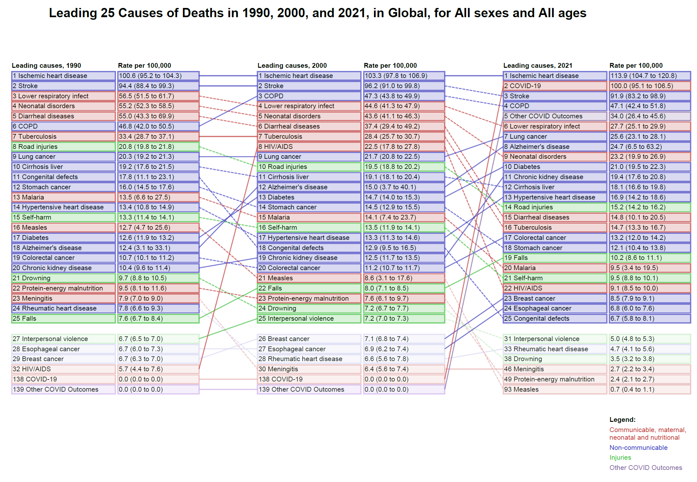

[LINK TO FIGURE ON GBD COMPARE](http://ihmeuw.org/6us5)
## Arrow diagrams are created using R and a package called reticulate to run a Python script within R.

## Note: This graphing function requires a conda environment, and about 1-3GB of disk space. We have provided a function, `install_reticulate()`,  which will install this conda environment for you.

### Steps
#### 1. Clone this repository,  or download the code onto your computer.
#### 2. Download the data you want from the GBD Results tool and save it in your inputs folder. 
(https://vizhub.healthdata.org/gbd-results/?params=gbd-api-2021-permalink/898b96e8fdf5dd9ee7476b58e84066ba)
1. Sign in to the GBD Results tool.
2. This link is set up for Global level 3 deaths. Choose "select all level 1/2/3/4 causes" in the causes dropdown to change cause level.
3. You can modify this input data for whatever measure, location, sex, age, or years that you want. This diagram works for the metric 'rate'. 
4. Download the data and save it in your inputs_folder.
#### 2. Update and run 0_create_arrow_diagram.R 
1. Change `your_user_repo` to the folder where you downloaded this repository
2. Update the `inputs_folder` and `input_df` arguments in `0_create_arrow_diagram.R` as needed. 
3. See the docstrings in `1_arrow_helper_functions.R` for details on  how to change folders, filepaths, and column years. 
4. Run `0_create_arrow_diagram.R` script. 
    - Figure will be output as `arrow_diagram_{location}_{measure}_{sex_name}_{age_name}.pdf` to your `outputs_folder`.

#### What is 0_create_arrow_diagram.R doing?
1. It sources functions from `1_arrow_helper_function.R`
2. It sets up the python environment you need using `install_reticulate()`
	- Note: reticulate, miniconda, and conda environments are large files and need 1-3GB of file space to install. The `install_reticulate()` function will check if you have reticulate, miniconda, and a conda environment installed. If you don't, it will install them for you. These packages are required for the function create_arrow_diagram
3. It creates the arrow diagram using `create_arrow_diagram()` by:
	- reformatting input data using `arrow_data_prep()`
	- running the python script `2_arrow_chart_gen.py` from within RStudio using `make_arrow_chart()`

All packages should install automatically if required.
 
required packages in Rstudio:
- data.table
- reticulate: https://rstudio.github.io/reticulate/

required packages in your Python Environment:
- pandas
- reportlab

For more information on reticulate, miniconda, and conda environments, see:
- https://rstudio.github.io/reticulate/
- https://rstudio.github.io/reticulate/reference/install_miniconda.html

