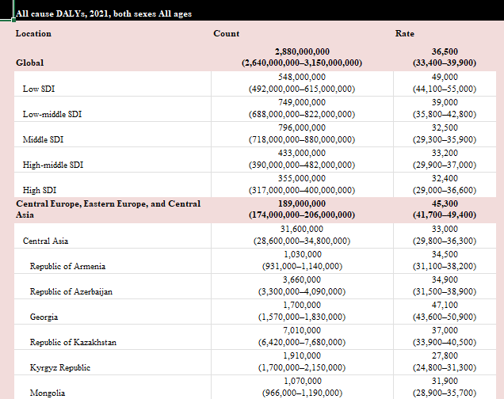

When downloading GBD results from the GBD Results Tool, GBD Compare, or other resources data will come with separate columns for man values, lower uncertainty interval value, and upper uncertainty interval values.

The program here, written in R is what IHME uses to present these data in proper tabular form for journals, keeping rounding, formatting, and other needs in mind

## To Use
`Lancet_Format.R` is a function that can be called in your Rstudio session. A sample of how to use this function is provided in the `sample_code_lancet.R` file